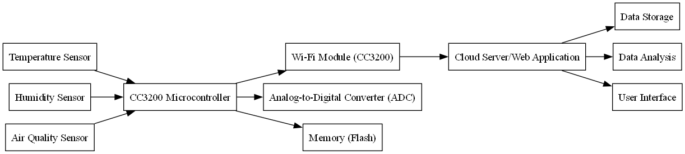

# CC3200 Course Summary Report

## 1. Course Overview

The CC3200 course primarily focuses on the CC3200 wireless microcontroller introduced by TI (Texas Instruments). This chip integrates an ARM Cortex-M4 processor and a Wi-Fi module, making it suitable for Internet of Things (IoT) applications. The course content covers hardware design, software development, network communication, and more, aiming to help students master the development process and application scenarios of the CC3200.

## 2. Key Learning Content

- **Hardware Architecture**: Studied the core architecture of the CC3200, including the ARM Cortex-M4 processor, Wi-Fi module, Memory Management Unit (MMU), and other components.
- **Software Development Environment**: Familiarized with the development toolchain provided by TI, including Code Composer Studio (CCS) and SimpleLink SDK, and learned how to configure and compile projects in CCS.
- **Wi-Fi Connectivity**: Learned how to achieve network connectivity for devices through the CC3200's Wi-Fi module, including Station mode and Access Point mode.
- **IoT Application Development**: Through practical projects, mastered how to use the CC3200 to implement data acquisition, remote control, cloud communication, and other IoT applications.
- **Low-Power Design**: Learned how to optimize the power consumption of the CC3200 to ensure long-term operation on battery power.

## 3. Practical Project – CC3200 Environmental Monitoring System

This system is based on the CC3200 microcontroller and can collect environmental data such as temperature, humidity, and air quality in real-time, uploading the data to the cloud via Wi-Fi. The system design aims to provide a low-cost, efficient environmental monitoring solution.

### System Composition

#### Hardware Components

- **CC3200 Microcontroller**: The main controller responsible for data acquisition and processing.
- **Sensor Module**:
  - Temperature Sensor: Measures ambient temperature.
  - Humidity Sensor: Measures ambient humidity.
  - Air Quality Sensor: Detects the concentration of harmful gases in the air.
- **Wi-Fi Module**: Used for wireless data transmission.
- **Power Module**: Provides stable power to the system.

#### Software Components

- **Data Acquisition Program**: Responsible for reading data from sensors.
- **Data Processing Program**: Filters and calibrates the collected data.
- **Data Transmission Program**: Uploads the processed data to the cloud via Wi-Fi.
- **Cloud Platform**: Receives and stores data, providing data visualization and analysis functions.

### Data Processing Flow

1. **Data Acquisition**: The sensor module collects environmental data in real-time.
2. **Data Processing**: The collected data is filtered and calibrated to remove noise and improve accuracy.
3. **Data Upload**: The processed data is uploaded to the cloud via the Wi-Fi module.
4. **Data Storage and Analysis**: The cloud platform receives the data, stores it, and provides real-time monitoring and data analysis functions.

### System Advantages

- **Real-Time Performance**: Data acquisition and upload occur in real-time, ensuring timely data.
- **Low Power Consumption**: The system design optimizes power consumption, making it suitable for long-term operation.
- **Easy Expansion**: The modular system structure allows for easy addition of more sensors or functions.

### Application Scenarios

- **Smart Home**: Real-time monitoring of indoor environments to improve living comfort.
- **Agricultural Monitoring**: Monitoring environmental parameters in greenhouses or farmland to optimize growing conditions.
- **Industrial Monitoring**: Monitoring factory workshop environments to ensure production safety.

### Future Improvement Directions

- **Adding More Sensors**: Such as light sensors, noise sensors, etc.
- **Optimizing Data Transmission Protocols**: Improving the efficiency and reliability of data transmission.
- **Enhancing Data Analysis Functions**: Providing more complex data analysis algorithms.

## 4. Learning Outcomes

Through the CC3200 course, I gained an in-depth understanding of the design and development process of IoT devices, especially accumulating valuable experience in Wi-Fi communication and low-power design. The practical projects in the course also gave me a deeper understanding of the real-world applications of the CC3200, laying a solid foundation for future work in IoT-related fields.

## 5. Future Prospects

In the future, I plan to further explore the advanced features of the CC3200, such as security enhancements and network protocol optimization. Additionally, I hope to apply the knowledge I have gained to more practical projects, contributing to the advancement of IoT technology.